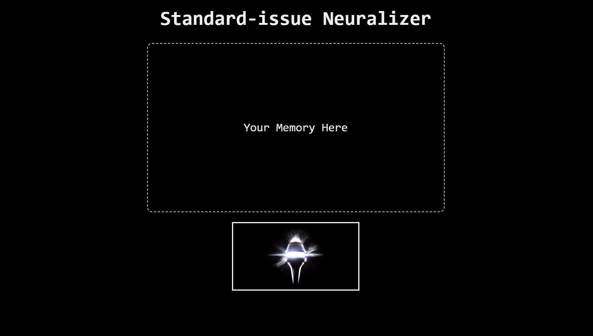
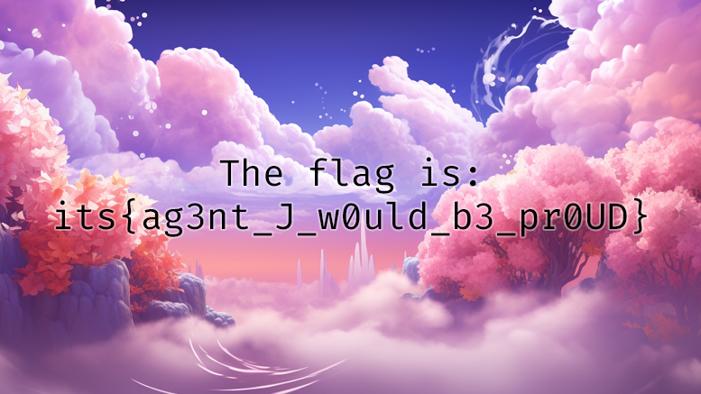

# Люди в... каком?
#### Write-Up на задание с It's Tinkoff CTF
Нам дано изображение, которое нужно дешифровать и ссылка на сайт.

Сайт выглядит вот так:

На нём можно загружать картинки, которые как-то обрабатываются, и обработанную картинку мы можем скачать.
Позагружав разные пикчи, понимаем, что её размер и пиксели сохраняются, но порядок пикселей меняется.
Значит нужно понять в каком порядке меняется порядок пикселей. Потыкав картинки можно понять, что он меняется каждый раз одинаково и не зависит от значений пикселей.

Окей, создадим пикчу такого же размера, и сделаем каждый её пиксель уникальным, чтобы восстановить перестановку. 
После этого применим обратную перестановку к пикселям на зашифрованной картинке.

``` python
from PIL import Image


def make_pic():
    im = Image.open("clear.png")  # clear image with needed size
    for i in range(256):
        for j in range(256):
            for k in range(256):
                summ = i * (256 ** 2) + j * 256 + k
                x, y = summ % 777, summ // 777
                if y >= 437:
                    break
                im.putpixel((x, y), (i, j, k))
    im.save("mod.png")


def check_pic():
    mapa = dict()
    im = Image.open("saved.png")  # mod.png after encrypting
    for x in range(im.size[0]):
        for y in range(im.size[1]):
            r, g, b = im.getpixel((x, y))
            summ = r * (256 ** 2) + g * 256 + b
            x1, y1 = summ % 777, summ // 777
            mapa[(x, y)] = (x1, y1)
    return mapa


def decrypt_pic():
    decrypt_map = check_pic()
    im = Image.open("flashied.png")
    clear = Image.open("clear.png")
    for x in range(im.size[0]):
        for y in range(im.size[1]):
            clear.putpixel(decrypt_map[(x, y)],
                           im.getpixel((x, y)))
    clear.save("flag.png")


if __name__ == "__main__":
    # make_pic()
    decrypt_pic()
```
Для запуска скрипта необходимо создать `clear.png` пикчу, выполнить `make_pic()`,
потом отправить получившуюся пикчу на сайт, скачать зашифрованную пикчу, и выполнить `decrypt_pic()`.

Получившееся изображение:
